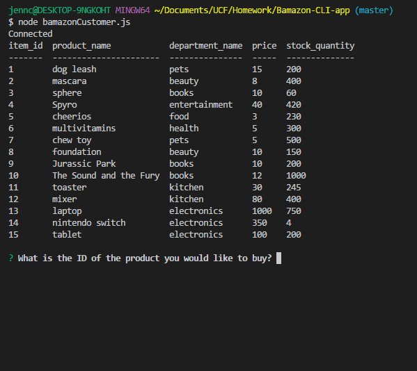
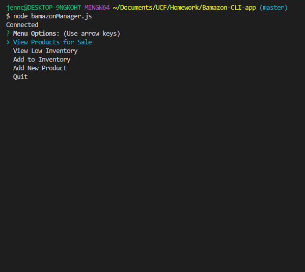

# Bamazon-CLI-app
An Amazon-like storefront app that tracks inventory using MySQL.

## Customer View
Running the application will display a products table with the following columns:

   * item_id (unique id for each product)

   * product_name (Name of product)

   * department_name

   * price (cost to customer)

   * stock_quantity (how much of the product is available in stores)

Then the app prompts the user with two messages.

   * The first asks the ID of the product they would like to buy.
   * The second asks how many units of the product they would like to buy.

If the store has enough product, the customer's order will be filled and the table will be updated accordingly.

## Manager View
Running this application will:

  * List a set of menu options:

    * View Products for Sale
    
    * View Low Inventory
    
    * Add to Inventory
    
    * Add New Product

  * If a manager selects `View Products for Sale`, the app lists every available item: the item IDs, names, prices, and quantities.

  * If a manager selects `View Low Inventory`, then it lists all items with an inventory count lower than five.

  * If a manager selects `Add to Inventory`, the app will display a prompt that will let the manager "add more" of any item currently in the store.

  * If a manager selects `Add New Product`, it allows the manager to add a completely new product to the store.

  